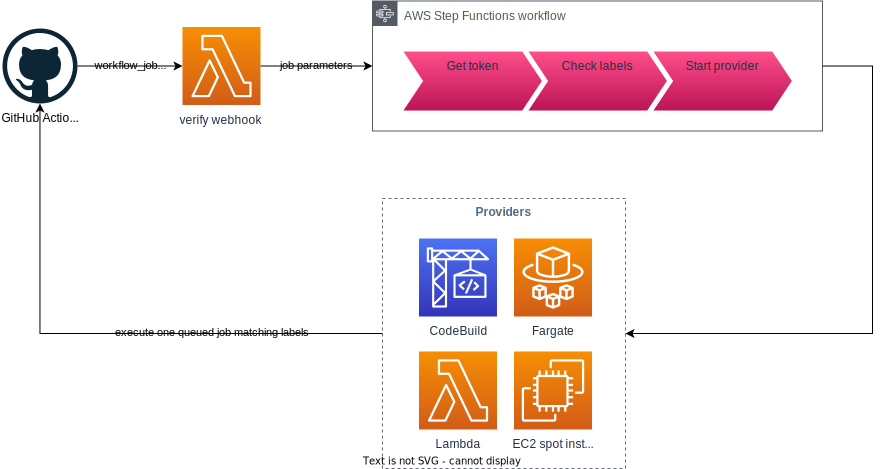

# GitHub Self-Hosted Runners CDK Constructs

[][6]
[][7]
[][8]
[][11]
[][12]
[](https://github.com/CloudSnorkel/cdk-github-runners/actions/workflows/release.yml)
[](https://github.com/CloudSnorkel/cdk-github-runners/blob/main/LICENSE)

Use this CDK construct to create ephemeral [self-hosted GitHub runners][1] on-demand inside your AWS account.

* Easy to configure GitHub integration
* Customizable runners with decent defaults
* Supports multiple runner configurations controlled by labels
* Everything fully hosted in your account

Self-hosted runners in AWS are useful when:

* You need easy access to internal resources in your actions
* You want to pre-install some software for your actions
* You want to provide some basic AWS API access ([aws-actions/configure-aws-credentials][2] has more security controls)

## API

Documentation of available constructs and their interface is available on [Constructs Hub][13] in all supported programming languages.

## Providers

A runner provider creates compute resources on-demand and uses [actions/runner][5] to start a runner.

| Provider  | Time limit               | vCPUs                    | RAM                               | Storage                      | sudo | Docker |
|-----------|--------------------------|--------------------------|-----------------------------------|------------------------------|------|--------|
| CodeBuild | 8 hours (default 1 hour) | 2 (default), 4, 8, or 72 | 3gb (default), 7gb, 15gb or 145gb | 50gb to 824gb (default 64gb) | ✔    | ✔     |
| Fargate   | Unlimited                | 0.25 to 4 (default 1)    | 512mb to 30gb (default 2gb)       | 20gb to 200gb (default 25gb) | ✔    | TBD    |
| Lambda    | 15 minutes               | 1 to 6 (default 2)       | 128mb to 10gb (default 2gb)       | Up to 10gb (default 10gb)    | ❌    | ❌     |

The best provider to use mostly depends on your current infrastructure. When in doubt, CodeBuild is always a good choice. Execution history and logs are easy to view, and it has no restrictive limits unless you need to run for more than 8 hours.

You can also create your own provider by implementing `IRunnerProvider`.

## Installation

1. Confirm you're using CDK v2
2. Install the appropriate package
   1. [Python][6]
      ```
      pip install cloudsnorkel.cdk-github-runners
      ```
   2. [TypeScript or JavaScript][7]
      ```
      npm i @cloudsnorkel/cdk-github-runners
      ```
   3. [Java][8]
      ```xml
      <dependency>
      <groupId>com.cloudsnorkel</groupId>
      <artifactId>cdk.github.runners</artifactId>
      </dependency>
      ```
   4. [Go][11]
      ```
      go get github.com/CloudSnorkel/cdk-github-runners-go/cloudsnorkelcdkgithubrunners
      ```
   5. [.NET][12]
      ```
      dotnet add package CloudSnorkel.Cdk.Github.Runners
      ```
3. Use `GitHubRunners` construct in your code (starting with default arguments is fine)
4. Deploy your stack
5. Look for the status command output similar to `aws --region us-east-1 lambda invoke --function-name status-XYZ123 status.json`
6. Execute the status command (you may need to specify `--profile` too) and open the resulting `status.json` file
7. [Setup GitHub](SETUP_GITHUB.md) integration as an app or with personal access token
8. Run status command again to confirm `github.auth.status` and `github.webhook.status` are OK
9. Trigger a GitHub action that has a `self-hosted` label with `runs-on: [self-hosted, linux, codebuild]` or similar
10. If the action is not successful, see [troubleshooting](#Troubleshooting)

## Customizing

The default providers configured by [`GitHubRunners`](https://constructs.dev/packages/@cloudsnorkel/cdk-github-runners/v/0.0.11/api/GitHubRunners?lang=typescript) are useful for testing but probably not too much for actual production work. They run in the default VPC or no VPC and have no added IAM permissions. You would usually want to configure the providers yourself.

For example:

```typescript
import * as cdk from 'aws-cdk-lib';
import { aws_ec2 as ec2, aws_s3 as s3 } from 'aws-cdk-lib';
import { GitHubRunners, CodeBuildRunner } from '@cloudsnorkel/cdk-github-runners';

const app = new cdk.App();
const stack = new cdk.Stack(
  app,
  'github-runners-test',
  {
     env: {
        account: process.env.CDK_DEFAULT_ACCOUNT,
        region: process.env.CDK_DEFAULT_REGION,
     },
  },
);

const vpc = ec2.Vpc.fromLookup(stack, 'vpc', { vpcId: 'vpc-1234567' });
const runnerSg = new ec2.SecurityGroup(stack, 'runner security group', { vpc: vpc });
const dbSg = ec2.SecurityGroup.fromSecurityGroupId(stack, 'database security group', 'sg-1234567');
const bucket = new s3.Bucket(stack, 'runner bucket');

// create a custom CodeBuild provider
const myProvider = new CodeBuildRunner(
  stack, 'codebuild runner',
  {
     label: 'my-codebuild',
     vpc: vpc,
     securityGroup: runnerSg,
  },
);
// grant some permissions to the provider
bucket.grantReadWrite(myProvider);
dbSg.connections.allowFrom(runnerSg, ec2.Port.tcp(3306), 'allow runners to connect to MySQL database');

// create the runner infrastructure
new GitHubRunners(
  stack,
  'runners',
  {
    providers: [myProvider],
    defaultProviderLabel: 'my-codebuild',
  }
);

app.synth();
```

## Architecture



## Troubleshooting

1. Always start with the status function, make sure no errors are reported, and confirm all status codes are OK
2. Confirm the webhook Lambda was called by visiting the URL in `troubleshooting.webhookHandlerUrl` from `status.json`
   1. If it's not called or logs errors, confirm the webhook settings on the GitHub side
   2. If you see too many errors, make sure you're only sending `workflow_job` events 
3. Check execution details of the orchestrator step function by visiting the URL in `troubleshooting.stepFunctionUrl` from `status.json`
   1. Use the details tab to find the specific execution of the provider (Lambda, CodeBuild, Fargate, etc.)
   2. Every step function execution should be successful, even if the runner action inside it failed

## Other Options

1. [philips-labs/terraform-aws-github-runner][3] if you're using Terraform
2. [actions-runner-controller/actions-runner-controller][4] if you're using Kubernetes


[1]: https://docs.github.com/en/actions/hosting-your-own-runners/about-self-hosted-runners
[2]: https://github.com/marketplace/actions/configure-aws-credentials-action-for-github-actions
[3]: https://github.com/philips-labs/terraform-aws-github-runner
[4]: https://github.com/actions-runner-controller/actions-runner-controller
[5]: https://github.com/actions/runner
[6]: https://www.npmjs.com/package/@cloudsnorkel/cdk-github-runners
[7]: https://pypi.org/project/cloudsnorkel.cdk-github-runners
[8]: https://search.maven.org/search?q=g:%22com.cloudsnorkel%22%20AND%20a:%22cdk.github.runners%22
[9]: https://docs.github.com/en/developers/apps/getting-started-with-apps/about-apps
[10]: https://docs.github.com/en/authentication/keeping-your-account-and-data-secure/creating-a-personal-access-token
[11]: https://pkg.go.dev/github.com/CloudSnorkel/cdk-github-runners-go/cloudsnorkelcdkgithubrunners
[12]: https://www.nuget.org/packages/CloudSnorkel.Cdk.Github.Runners/
[13]: https://constructs.dev/packages/@cloudsnorkel/cdk-github-runners/